# ProofNet — Technical Architecture

> Status: planning baseline for the MVP (Part 1 — Compute Fabric) with defined insertion points for Part 2 (Trust, Verification, Security).
> Companion documents: `CLAUDE.md` (operational source of truth) and `PHASE_PLAN.md` (implementation roadmap). If these documents ever disagree, fix the disagreement — do not pick one silently.

---

## 0. How to read this document

| Section | What it answers |
|---|---|
| 1 | What the system is and the key decisions behind it |
| 2 | The two planes: control plane vs compute plane |
| 3 | Components (frontend, backend, worker, kernels, database, storage) |
| 4 | Workload model — what we compute and why it is correct to split |
| 5 | Task submission, validation and preparation |
| 6 | Chunking and device-aware scheduling |
| 7 | Contributor devices: registration, capabilities, the Android worker |
| 8 | Worker ↔ backend communication protocol |
| 9 | Execution, result collection and aggregation |
| 10 | State machines (task, chunk, assignment, device) |
| 11 | Failure handling |
| 12 | Data model (MongoDB collections) |
| 13 | API surface |
| 14 | Security boundary |
| 15 | Observability for the demo |
| 16 | Deployment (Vercel, backend host, MongoDB Atlas) and local development |
| 17 | Part 2 insertion points (verification → trust → PWAV → reward) |
| 18 | Future scalability paths |
| 19 | Decision log |

---

## 1. System summary and key decisions

ProofNet lets a **user** submit an ML workload and have it executed by **contributor devices** (initially Android phones). The backend validates the task, splits the dataset into partitions sized for each device, dispatches the partitions, collects partial results, merges them with a mathematically valid aggregation, and returns a final artifact (trained model + report).

The MVP is deliberately narrow so that it is **real**:

| # | Decision | Short reason |
|---|---|---|
| D1 | **Android worker = browser worker.** The contributor opens a ProofNet page in Chrome on Android. Python runs inside the page via **Pyodide** (CPython compiled to WebAssembly) in a **Web Worker**. | Zero install, works on any modern Android phone, WASM sandbox protects the phone, NumPy is available in Pyodide. |
| D2 | **Pull-based HTTPS polling.** Workers call `POST /worker/heartbeat`; the response carries any work directives. No inbound connections to phones. | Phones sit behind NAT/mobile networks; free hosts sleep and drop long-lived sockets; polling is the most debuggable option. |
| D3 | **FastAPI runs as a separate long-running service**, not inside Vercel. Vercel hosts only the Next.js frontend (including the worker page). | The backend needs a background reconciler loop, file streaming and stable state. Serverless functions are the wrong fit. |
| D4 | **MongoDB Atlas free tier is the only persistent store** — metadata in collections, files (datasets, prepared arrays, artifacts) in **GridFS**. | Free hosts have ephemeral disks; avoids any paid object storage; MVP files are small. |
| D5 | **Controlled task catalog, no user-supplied Python.** Users pick a task type and supply data + parameters. All executable code is ProofNet-authored **kernels**. | Removes the arbitrary-remote-code-execution problem from the MVP entirely. |
| D6 | **Initial workloads are sufficient-statistics ML training**: Gaussian Naive Bayes (classification) and Linear/Ridge regression. | Their distributed result is *provably identical* (up to floating-point tolerance) to centralized training. |
| D7 | **Scheduler = weighted proportional partitioning by measured benchmark score**, with eligibility filters and memory caps. | Simple, explainable, deterministic, device-aware, easy to replace. |
| D8 | **Single backend instance with an idempotent reconciler loop**, all state transitions as conditional atomic MongoDB updates. | No queue service needed; survives restarts because state is in the DB. |
| D9 | **Workers return JSON only; the backend never unpickles anything received from a worker or user.** `.joblib` artifacts are produced only by the backend from validated numbers. | Pickle is code execution. |
| D10 | **Contract-first:** FastAPI's OpenAPI schema is the single source of API types; the TypeScript client types are generated from it. | Keeps frontend, worker and backend in sync for a student team. |

What the MVP explicitly does **not** do: arbitrary ML frameworks, user Python code, deep learning, blockchain/tokens, consensus, Kubernetes, microservices, trust scores, PWAV. See `CLAUDE.md` § Scope.

---

## 2. Control plane vs compute plane

This distinction is fundamental. Nothing in the control plane performs the distributed workload; nothing in the compute plane decides what to do.

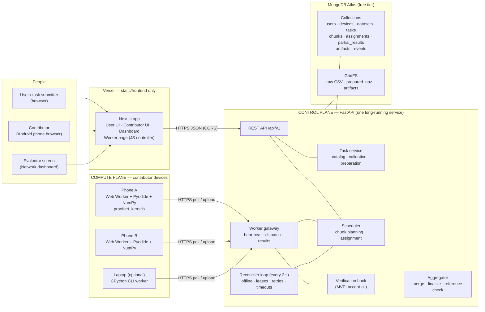

**Control plane** (FastAPI + MongoDB): identity, device registry, task catalog, validation, preparation of data, planning, assignment, leases, result validation, aggregation, artifacts, events. It does only *light* computation: parsing CSV, slicing arrays, merging small statistics, building the final model object, and (optionally) the centralized reference check on small data.

**Compute plane** (contributor devices): executes the map kernel on its assigned partition and returns a partial result. It holds no authoritative state.

**Vercel** serves the frontend bundle, including the JavaScript of the worker page. Vercel functions are not used for workload execution, polling targets, or file storage.

---

## 3. Components

### 3.1 Repository layout (monorepo)

```
proofnet/
├── CLAUDE.md · PHASE_PLAN.md · ARCHITECTURE.md
├── apps/web/                    Next.js + TypeScript (deployed to Vercel)
│   ├── app/                     routes (see 3.2)
│   ├── components/              UI components
│   ├── lib/api/                 generated OpenAPI types + thin fetch client
│   └── worker-runtime/          browser compute agent
│       ├── controller.ts        main-thread loop: heartbeat, dispatch, wake lock, UI state
│       └── compute.worker.ts    Web Worker: loads Pyodide, kernel bundle, runs map kernels
├── services/api/                FastAPI control plane
│   └── proofnet_api/
│       ├── main.py · config.py · db.py · ids.py
│       ├── auth/                users, JWT, device tokens
│       ├── devices/             registry, capabilities, benchmark records
│       ├── worker_gateway/      heartbeat, directives, input streaming, result intake
│       ├── datasets/            upload, profiling, GridFS
│       ├── tasks/               catalog, validation, preparation, task lifecycle
│       ├── scheduling/          planner (chunking) + assigner + policies
│       ├── aggregation/         merge, finalize, reference check, reports
│       ├── artifacts/           storage + download
│       ├── events/              append-only event log + status snapshots
│       ├── verification/        hook interfaces (MVP: pass-through)   ← Part 2 grows here
│       └── reconciler.py        periodic idempotent maintenance loop
├── packages/kernels/            proofnet_kernels — SHARED Python package
│   └── proofnet_kernels/
│       ├── core/                NumPy + stdlib ONLY (runs in Pyodide and CPython)
│       │   ├── gaussian_nb.py   map + merge
│       │   ├── linear_ridge.py  map + merge
│       │   ├── moments.py       Chan/parallel moment merge utilities
│       │   ├── bench.py         benchmark workload
│       │   └── serialize.py     canonical JSON, digests, array encoding
│       └── server/              backend-only (scikit-learn, pandas): finalize, reference, compare
├── workers/cli-worker/          CPython reference worker (laptops, CI, fault injection)
├── datasets/                    deterministic demo-dataset generator + tiny fixtures
└── scripts/                     dev helpers: seed users, reset demo, run N simulated workers
```

The split `core/` vs `server/` is the key code boundary: **anything a worker runs must live in `core/` and import only NumPy and the standard library.** The backend imports both.

### 3.2 Frontend (Next.js + TypeScript, Vercel)

Pure client of the FastAPI API. No business logic in Next.js API routes (none are needed in the MVP). Pages:

| Route | Audience | Purpose |
|---|---|---|
| `/` | everyone | Landing + live network summary (devices online, tasks running) |
| `/login`, `/signup` | everyone | Simple account auth |
| `/tasks/new` | user | Wizard: choose task type → upload CSV → map columns/params → **validate** → **plan preview** → submit |
| `/tasks` | user | My tasks |
| `/tasks/[id]` | user, evaluator | Live task monitor: state timeline, chunk table, device lanes, aggregation, correctness check, downloads |
| `/contribute` | contributor | My devices, register this device |
| `/contribute/run` | contributor (on the phone) | **Worker console**: runtime loading, benchmark, status, current assignment, log, completed work, keep-awake toggle |
| `/network` | evaluator (projector) | Big-screen dashboard: all devices, states, current chunks, recent events |

Data freshness: dashboards poll `GET /tasks/{id}/status` and `GET /network/summary` every ~1.5 s. (SSE is a later enhancement, §18.)

### 3.3 Backend (Python + FastAPI)

- Python 3.12 (pinned; versions in CLAUDE.md §12), FastAPI, Pydantic v2, PyMongo's async API (`AsyncMongoClient`), NumPy, pandas, scikit-learn (pinned versions), PyJWT, a password hashing library.
- One process, one instance. On startup it launches the **reconciler** as an asyncio background task.
- All state transitions use conditional updates (`find_one_and_update` with a status precondition), so a duplicate request or a reconciler re-run cannot apply a transition twice.
- Expected load is tiny (a few devices and dashboards). The design keeps backend CPU work small because free hosts provide very little CPU (§16).

### 3.4 Kernels (`proofnet_kernels`)

A **kernel** is the unit of supported computation. Each task type is implemented by one kernel with a fixed interface:

| Function | Runs on | Purpose |
|---|---|---|
| `Params` (Pydantic model) | backend | Typed parameters + defaults + limits |
| `validate(dataset_profile, params)` | backend | Can this dataset + params be executed? Returns a structured report |
| `prepare(dataframe, params)` | backend | Produce a numeric, validated `PreparedData` (train/test arrays, encodings) |
| `map(X, y, worker_params)` | **worker** (`core/`) | Compute the partial result for one partition → JSON-serializable dict |
| `validate_partial(partial, chunk)` | backend | Structural check: keys, shapes, dtypes, finiteness, counts match chunk |
| `merge(partials)` | backend (`core/`, so future hierarchical merge is possible) | Combine partials into one merged state |
| `finalize(merged, prepared, params)` | backend (`server/`) | Build final model object, metrics on holdout, artifacts |
| `reference(prepared, params)` | backend (`server/`) | Centralized computation of the same merged state (correctness check) |
| `compare(a, b)` | backend (`server/`) | Discrepancy metrics between two states/partials — reused by Part 2 verification |

Kernels are versioned (`gaussian_nb_train@1`). A task records the kernel version it was created with; workers report which kernel bundle they loaded; the scheduler only assigns chunks to workers with a matching bundle.

### 3.5 Database and storage summary

| Data | Where | Persistent? |
|---|---|---|
| Users, devices, tasks, chunks, assignments, partial results, artifact metadata, events | MongoDB collections | Yes |
| Uploaded raw CSV | GridFS (`fs.files`/`fs.chunks`) | Yes |
| Prepared dataset (`.npz`: `X_train, y_train, X_test, y_test`, no pickle) | GridFS | Yes |
| Chunk input | **Not stored** — sliced on demand from the prepared array by row range and streamed as `.npz` | Derived (reproducible) |
| Partial results | Inline JSON in `partial_results` documents (they are KB-sized) | Yes |
| Final artifacts (`model.joblib`, `model.json`, `report.json`, `predictions.csv`) | GridFS + `artifacts` metadata | Yes |
| Backend temp files | Backend local disk / memory | **Ephemeral** — never relied on |
| Worker data | Phone memory (WASM heap) during execution | **Ephemeral** — discarded after each assignment |
| Device token | Phone `localStorage` (raw) + DB (SHA-256 hash) | Yes |

Capacity: Atlas free tier provides 512 MB total storage, so MVP limits are a 25 MB CSV per upload, demo data cleanup via a reset script, and no storage of chunk copies. Atlas free tier also caps throughput (on the order of 100 operations/second), which is why status snapshots are cached for ~1 s in the backend and heartbeat intervals are a few seconds.

---

## 4. Workload model

### 4.1 Why not "any ML training"

Most training algorithms (gradient-boosted trees, neural nets, k-means, SVMs) cannot be split into independent partitions whose results merge into the exact centralized model. Pretending otherwise would produce a demo that "works" but computes a different, unexplained result. ProofNet therefore starts with workloads whose decomposition is **exact**:

```
dataset ──partition by rows──▶ P1 … Pk ──map on devices──▶ partial statistics ──merge──▶ global statistics ──finalize──▶ model
```

This is the classic **sufficient statistics** pattern: the model depends on the data only through quantities (counts, means, co-moment matrices) that combine associatively across partitions.

### 4.2 MVP task types

#### `gaussian_nb_train` — classification (first, must-work)

- **Map (per partition, per class c):** `n_c`, `mean_c` (d-vector), `M2_c` (d-vector of summed squared deviations). Also overall `n`, `mean`, `M2` per feature (needed for sklearn's variance smoothing).
- **Merge:** pairwise parallel moment combination (Chan et al.):
  `n = n_a + n_b`, `δ = mean_b − mean_a`, `mean = mean_a + δ·n_b/n`, `M2 = M2_a + M2_b + δ²·n_a·n_b/n`. Numerically stable; avoids `Σx² − (Σx)²` cancellation.
- **Finalize:** `theta_ = mean_c`, `var_ = M2_c/n_c + ε`, `ε = var_smoothing · max(global feature variance)`, `class_prior_ = n_c / n`. Construct a scikit-learn `GaussianNB` with these fitted attributes (pinned sklearn version), save `model.joblib` and a portable `model.json`, evaluate accuracy / macro-F1 / confusion matrix on the holdout set.
- **Correctness:** equals `GaussianNB().fit(X_train, y_train)` within tolerance (default `rtol = 1e-8`), for any partitioning.
- **Partial size:** `C · (1 + 2d)` numbers — a few KB.

#### `linear_ridge_train` — regression (second, required for the MVP freeze)

- **Map:** `n`, `mean_x` (d), `mean_y`, `Sxx = Σ(x−x̄)(x−x̄)ᵀ` (d×d), `Sxy = Σ(x−x̄)(y−ȳ)` (d), `Syy`.
- **Merge:** parallel co-moment update: `Sxx = Sxx_a + Sxx_b + (n_a n_b / n)·δx δxᵀ`, `Sxy = … + (n_a n_b / n)·δx δy`, `Syy = … + (n_a n_b / n)·δy²`, means as above.
- **Finalize:** solve `(Sxx + αI) β = Sxy`, `intercept = ȳ − x̄ᵀβ` (identical to sklearn `Ridge(fit_intercept=True)`; `α = 0` → ordinary least squares, with least-squares fallback if singular). Metrics: R², RMSE, MAE on holdout.
- **Correctness:** equals centralized sklearn `Ridge`/`LinearRegression` within tolerance (coefficients `rtol = 1e-6`, defined in the kernel).
- **Partial size:** `O(d²)` numbers; with `d ≤ 64` that is ≤ ~4,200 numbers.

### 4.3 Honest notes about the workload

- Per-chunk compute for these kernels is small (typically well under a few seconds on a phone even for tens of thousands of rows). Transfer and runtime start-up often dominate. The dashboard shows **real measured timings**; ProofNet must never add artificial delays or fake progress.
- Holdout evaluation (metrics) is computed by the aggregator in the MVP. This is labelled as aggregator-side work in the UI. Distributed evaluation (a second map stage summing confusion matrices / squared errors) is a planned enhancement (§18).
- The first visibly compute-heavy workload planned after the MVP is **partitioned exact kNN prediction**: the training set is partitioned across devices; each device returns the top-k nearest neighbours per query from its partition; the merge takes the global top-k. Exact, mergeable, and CPU-bound.

### 4.4 Task specification (manifest)

A submitted task is a validated JSON manifest — this is ProofNet's deterministic "task understanding" mechanism:

```json
{
  "name": "Iris-like 3-class demo",
  "task_type": "gaussian_nb_train",
  "kernel_version": "1",
  "dataset_id": "ds_01J…",
  "params": {
    "target_column": "label",
    "feature_columns": ["f0", "f1", "…"],
    "missing_values": "drop_rows",
    "test_fraction": 0.2,
    "split_seed": 42,
    "var_smoothing": 1e-9
  },
  "execution": {
    "min_devices": 2,
    "max_devices": 4,
    "start_policy": "wait_for_min_devices"
  }
}
```

The task type determines: what inputs are required, what the computation is, how it partitions (row ranges), and how partials merge. No guesswork, no LLM parsing.

---

## 5. Task submission, validation and preparation

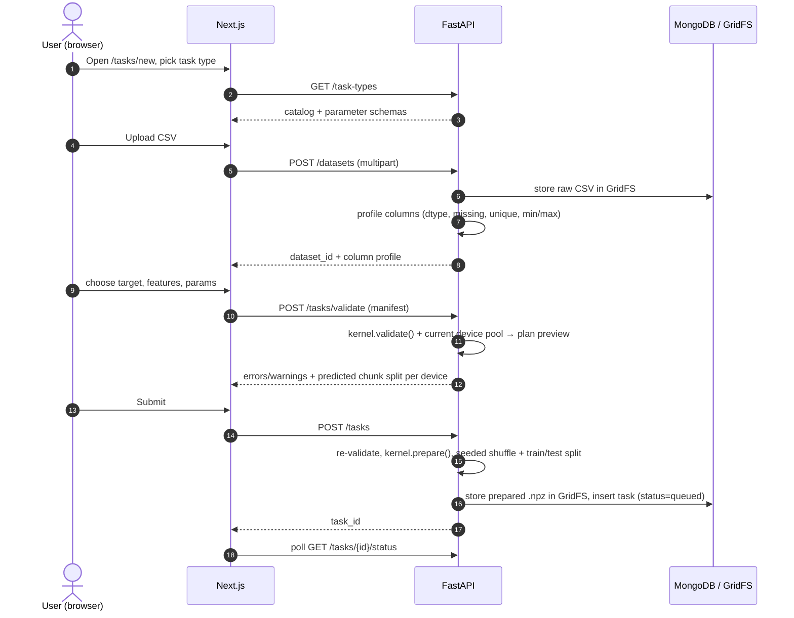

### 5.1 Validation rules (MVP)

| Check | Rule |
|---|---|
| File | UTF-8 CSV with header; ≤ 25 MB; ≤ 300,000 rows; ≥ 100 rows |
| Columns | Target exists; 1 ≤ features ≤ 64; feature columns numeric (categorical encoding is out of MVP scope — reject with a clear message) |
| Missing values | `drop_rows` (default, reports how many) or `reject` |
| Classification target | 2–50 distinct classes; each class has ≥ 2 training rows |
| Regression target | numeric, finite |
| Degenerate data | constant features → warning; all-constant → reject |
| Params | Pydantic bounds (e.g. `0.05 ≤ test_fraction ≤ 0.5`, `alpha ≥ 0`) |
| Execution | `1 ≤ min_devices ≤ max_devices ≤ 8` |

Validation output is a structured report (`ok`, `errors[]`, `warnings[]`, `summary`) stored on the task and displayed in the wizard. Invalid manifests never become tasks.

### 5.2 Preparation

`kernel.prepare` converts the CSV into `float64` features and target (class labels mapped to `0..C−1`, mapping stored), applies the missing-value policy, applies a seeded shuffle, and splits train/test. The result is stored once as a pickle-free `.npz` in GridFS with its SHA-256. Chunks reference **row ranges of `X_train`**; chunk inputs are derived from this file, so they are reproducible byte-for-byte (important for Part 2 re-execution).

---

## 6. Chunking and device-aware scheduling

### 6.1 Eligibility

A device is eligible for a new assignment when **all** hold:

1. `status = idle` and heartbeat seen within the offline threshold (20 s).
2. Runtime ready: kernel bundle version matches the task's kernel version.
3. Has a benchmark score (measured this session).
4. Battery ≥ 20 % or charging (if the browser exposes battery info; unknown = allowed).
5. Memory budget ≥ chunk memory estimate (§6.2).
6. Not owner-disabled, and not in the chunk's `excluded_device_ids` (devices that already failed this chunk).
7. *(Part 2 hook)* Passes `DeviceEligibilityPolicy` — MVP implementation always returns true.

### 6.2 Planning algorithm (deterministic heuristic)

Executed once when a queued task can start (enough eligible devices per `start_policy`):

```
inputs: N training rows, d features, eligible devices E
sort E by (benchmark_score desc, device_id asc)                  # deterministic
k = min(|E|, max_devices, floor(N / MIN_CHUNK_ROWS))  (k ≥ 1)    # MIN_CHUNK_ROWS default 1000
take top-k devices; weights w_i = score_i / Σ score
rows_i = floor(N · w_i); give remaining rows by largest fractional part (ties → device order)
for each device i: if mem_estimate(rows_i, d) > mem_budget_i:
        split its share into ⌈estimate / budget⌉ equal chunks   # extra chunks queue on the same preferred device
create chunks with contiguous row ranges [start, end), preferred_device_id = device i
estimated_seconds = rows · d / score_i                          # shown in plan preview
```

- `benchmark_score` is measured in **cells/second** (rows × features processed by the real kernel code, §7.4), so it directly predicts chunk time.
- `mem_estimate = rows × (d + 1) × 8 bytes × 3` (input + working copies). Browser workers: `mem_budget = min(256 MB, 10 % of reported device memory)`; CLI workers: configured.
- Example: Phone A score 3.0 M cells/s, Phone B 1.5 M cells/s, N = 80,000 → exact shares 53,333.33 and 26,666.67; floors 53,333 and 26,666 leave 1 row, which goes to the larger fractional part (B, .67) → A gets 53,333 rows, B gets 26,667 rows. (Corrected in P5: an earlier draft said 53,334 / 26,666, which contradicted the algorithm.) Phone C offline → not considered. Phone D busy → not eligible; a `wait_for_min_devices` task stays queued until it frees up.

The plan (device shares, predicted times) is stored on the task and shown to the evaluator — explainability is part of the demo.

### 6.3 Assignment

Run by the reconciler and immediately after events that free capacity (task created, result received, device became idle):

1. For each `pending` chunk (oldest task first, then chunk index):
   - if its preferred device is eligible → assign to it;
   - else, if the chunk has been pending longer than `PREFERRED_WAIT` (10 s) or the preferred device is offline → assign to the best eligible device (by score) not in `excluded_device_ids`.
2. Assignment = insert an `assignments` document (`status = assigned`, lease) + conditional update of chunk `pending → assigned` + device `idle → busy`. If any precondition fails, roll back and try the next candidate.
3. **One active assignment per device** in the MVP (Pyodide is single-threaded).

The planner and assigner are separate, small, pure-ish modules behind interfaces (`ChunkPlanner`, `AssignmentPolicy`) so that Part 2 (replication, audits) and future schedulers (dynamic work-stealing, trust-weighted) can replace them.

---

## 7. Contributor devices

### 7.1 Android worker approach — options considered

| Option | Verdict |
|---|---|
| Windows `.exe` copied to phone | Not possible on Android. Rejected. |
| Termux + CPython + pip packages | Works for enthusiasts, but install friction is high, scientific packages are fragile to install on-device, and it is hard to set up reliably on an evaluator's phone. Kept as an *optional* path for the CLI worker. |
| Native Android app with embedded Python (e.g. Chaquopy) | Best background behaviour (foreground service), but adds Android build tooling, signing and sideloading. Good **future** upgrade. |
| Kivy / BeeWare app | Heavy packaging; same drawbacks as above. |
| **Browser + Pyodide (chosen)** | Open a URL, log in, tap "Start contributing". No install. WASM sandbox isolates the phone. NumPy ships with Pyodide. Same kernel source as the backend. Limitation: page must stay in the foreground with the screen on. |

**Accepted limitation and mitigation:** Android/Chrome throttles or freezes background tabs and pauses work when the screen turns off. The worker page therefore requests a **Screen Wake Lock** (requires HTTPS), tells the contributor to keep the tab in front and the phone charging, and the backend treats a frozen tab as an offline device (heartbeats stop → lease expires → chunk reassigned). This is honest and recoverable. A native wrapper with a foreground service is the documented future fix.

### 7.2 Worker runtime structure (browser)

- **Main thread (`controller.ts`)**: owns the device token, heartbeat/poll timer, HTTP calls, wake lock, UI. It keeps heartbeating *while* Python computes, because computation runs elsewhere.
- **Web Worker (`compute.worker.ts`)**: loads Pyodide (pinned version, from the jsDelivr CDN), loads NumPy, downloads the kernel bundle from the backend (`GET /runtime/kernels/{version}`), verifies its SHA-256 against `GET /runtime/manifest`, unpacks it, imports `proofnet_kernels.core`. Receives `{kernel, params, npz bytes}` messages, returns `{partial, compute_ms}`.
- **Cancel** = `worker.terminate()` + spin up a fresh Web Worker (simple and reliable).
- Pyodide + NumPy is a download of several MB on first load and is cached by the browser afterwards. Demo checklist: preload on Wi-Fi before the presentation.

The **CLI worker** (`workers/cli-worker`) implements the same protocol in CPython using the same `proofnet_kernels.core`. It is used for development, CI, multi-worker simulation on one laptop, fault injection, and laptops as optional extra contributors. It is not the primary demo device.

### 7.3 Capability discovery (what is genuinely available)

| Field | Browser source | Used for |
|---|---|---|
| `device_type` | user-agent heuristic + user confirmation (`android_phone`, `laptop`, `desktop`, `other`) | display, future policy |
| `model`, `platform_version` | `navigator.userAgentData.getHighEntropyValues` (Chromium) | display |
| `logical_cores` | `navigator.hardwareConcurrency` | display only (Pyodide is single-threaded) |
| `memory_gb_reported` | `navigator.deviceMemory` (Chromium, coarse, capped at 8) | memory budget |
| `storage_quota_mb` | `navigator.storage.estimate()` | display |
| `battery` | Battery Status API (Chrome Android) | eligibility |
| `network_type` | `navigator.connection.effectiveType` | display, future policy |
| `runtime` | Pyodide version, NumPy version, kernel bundle version | matching, Part 2 fingerprint |
| `benchmark` | measured (§7.4) | **scheduling weight** |

The browser cannot reveal the CPU model or exact RAM. ProofNet does not pretend otherwise; the measured benchmark is the real scheduling signal.

### 7.4 Benchmark (`bench_v1`)

Runs the actual `gaussian_nb` map kernel on a fixed-seed synthetic matrix (50,000 × 16, 3 classes) three times inside the Web Worker; score = cells / median seconds. Re-run on every worker session start. Stored with `bench_version` and runtime fingerprint so scores are comparable.

### 7.5 Registration flow

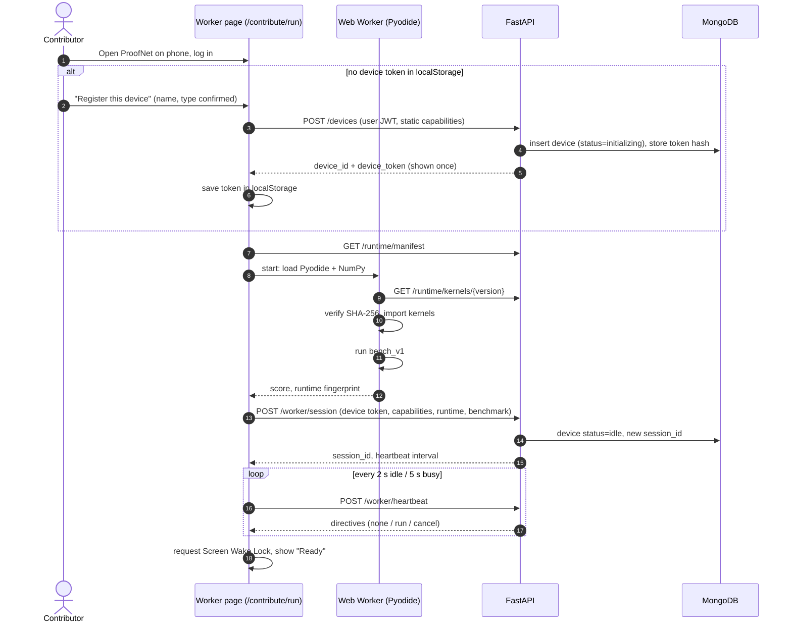

Device identity is **server-issued** (`dev_…`), bound to the owning user. Re-opening the page reuses the stored token → same device, new session. Clearing site data = re-register (old record can be disabled by the owner).

---

## 8. Communication protocol

### 8.1 Why polling

| Option | Assessment |
|---|---|
| Push to device (inbound) | Impossible behind NAT / mobile carriers. |
| WebSocket | Works, but adds reconnection logic, behaves poorly across free-host sleeps and redeploys, and is harder to debug. Not needed at MVP scale. |
| SSE | Fine for dashboards later; not needed for workers. |
| **HTTPS polling (chosen)** | Stateless, survives backend restarts, trivial to inspect with browser dev tools, works with any host and through tunnels. Latency of 1–2 s is irrelevant to the demo. |

### 8.2 Heartbeat = poll

`POST /worker/heartbeat` (device token) carries `{session_id, state, current_assignment_id?, battery?}` and returns:

```json
{
  "server_time": "2026-…Z",
  "next_heartbeat_ms": 2000,
  "directives": [
    { "type": "run", "assignment": {
        "assignment_id": "asg_…", "task_id": "tsk_…", "chunk_id": "chk_…",
        "kernel": "gaussian_nb_train", "kernel_version": "1",
        "params": { "n_classes": 3 },
        "input_url": "/api/v1/worker/assignments/asg_…/input",
        "input_sha256": "…", "n_rows": 26666, "n_features": 16,
        "deadline_at": "2026-…Z" } }
  ]
}
```

Other directive types: `cancel {assignment_id}`, `refresh_runtime {kernel_version}`, `reregister`.

Intervals: 2 s when idle, 5 s when busy. Offline threshold: 20 s without heartbeat.

### 8.3 Assignment protocol

1. Worker receives `run` → `POST /worker/assignments/{id}/start` (assigned → running).
2. `GET /worker/assignments/{id}/input` → `.npz` bytes with `X`, `y` for the row range. Worker checks SHA-256.
3. Worker runs `map` in the Web Worker. `np.load(..., allow_pickle=False)`.
4. `POST /worker/assignments/{id}/result` with:
   ```json
   { "kernel": "gaussian_nb_train", "kernel_version": "1",
     "input_sha256": "…", "n_rows": 26666,
     "payload": { "…partial statistics…" },
     "payload_sha256": "…",
     "timings": { "download_ms": 410, "compute_ms": 180, "total_ms": 650 },
     "runtime": { "kind": "pyodide", "pyodide": "x.y.z", "numpy": "a.b.c", "bundle": "1" } }
   ```
   or `POST /worker/assignments/{id}/fail` with `{code, message}`.
5. Worker returns to idle and keeps heartbeating.

Every write endpoint is **idempotent** per assignment (§11).

---

## 9. Execution, result collection and aggregation

### 9.1 End-to-end multi-device execution

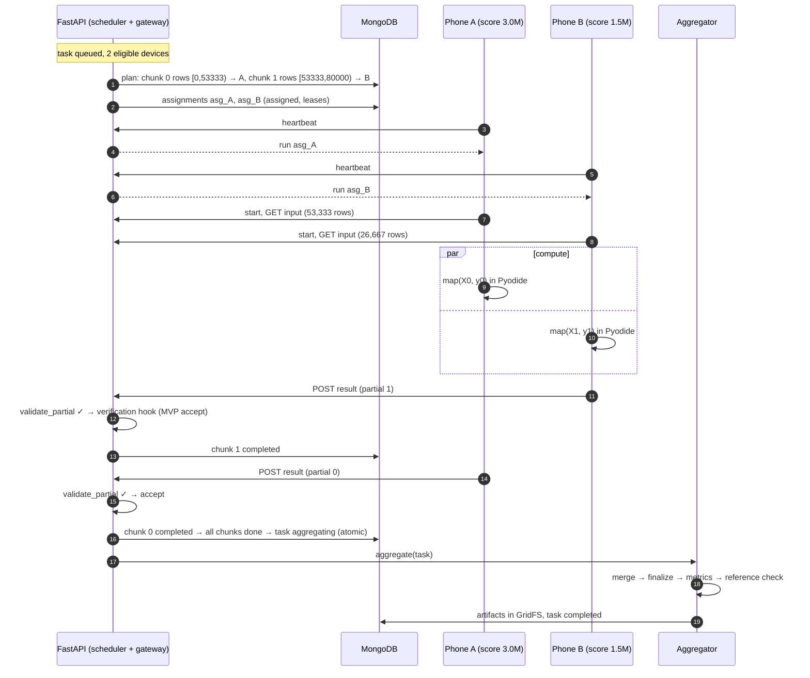

### 9.2 Result intake pipeline

```
POST result
  → auth: token belongs to assignment's device; assignment in {running}
  → structural: kernel/version match, input_sha256 match, kernel.validate_partial (shapes, finite, counts == chunk rows)
  → store partial_results doc (acceptance = pending)
  → VerificationHook.on_partial(partial) → MVP: accept → acceptance = accepted_unverified
  → assignment succeeded; chunk completed (accepted_assignment_id); device idle; stats updated
  → if all chunks completed: conditional update task running → aggregating, schedule aggregation
```

### 9.3 Aggregation

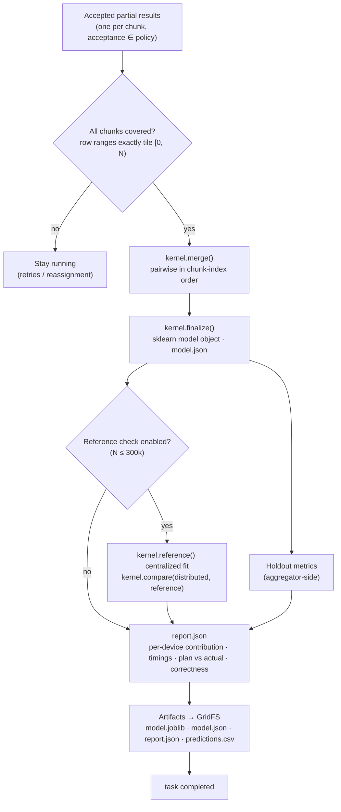

- Merge order is fixed (chunk index) so results are reproducible.
- The **reference check** — "distributed result equals centralized result (max relative difference 3.1e-14) ✓" — is the strongest proof for evaluators that the distributed computation is real and correct. It is cheap for these kernels.
- Aggregation is idempotent: guarded by the `running → aggregating` transition; if the backend restarts mid-aggregation, the reconciler re-runs aggregation for tasks stuck in `aggregating`.

### 9.4 Artifact management

| Artifact | Content |
|---|---|
| `model.joblib` | scikit-learn estimator built by the backend from merged statistics (pinned sklearn version recorded in report) |
| `model.json` | Portable parameters (classes, means, variances / coefficients, intercept, feature names) — safe to load anywhere |
| `report.json` | Task manifest, validation summary, plan, per-chunk/per-device timings, metrics, reference check, kernel and runtime versions, digests |
| `predictions.csv` | Holdout predictions vs actual |

Downloads via `GET /artifacts/{id}/download` (owner only). The UI warns that `.joblib` files are pickles and should only be loaded from a trusted ProofNet instance; `model.json` is the safe alternative.

---

## 10. State machines

### 10.1 Task

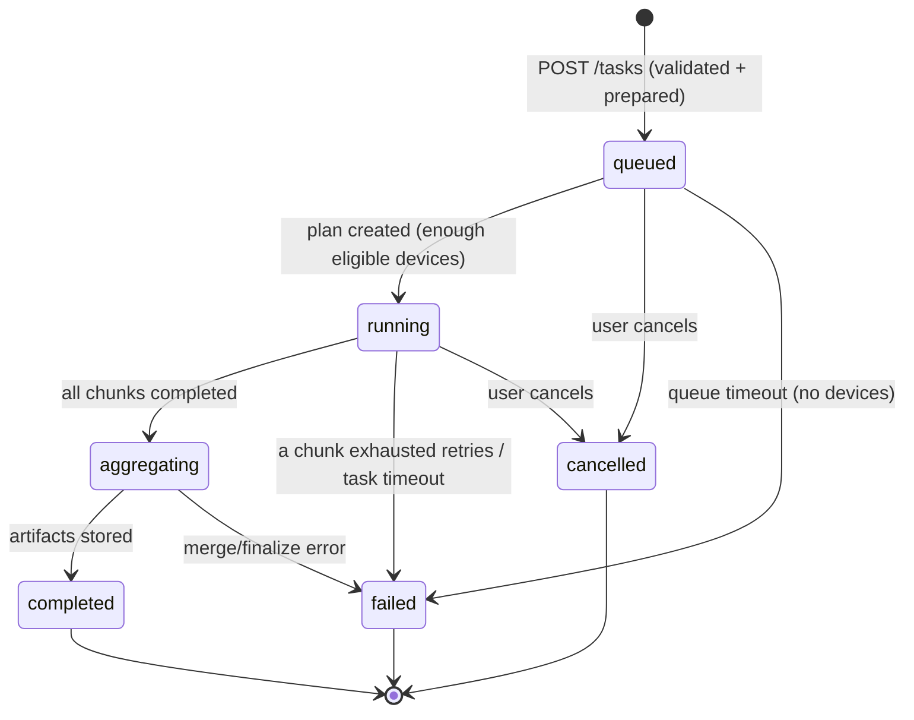

Every transition appends to `status_history` and emits an event. Invalid submissions never enter this machine.

### 10.2 Chunk and assignment

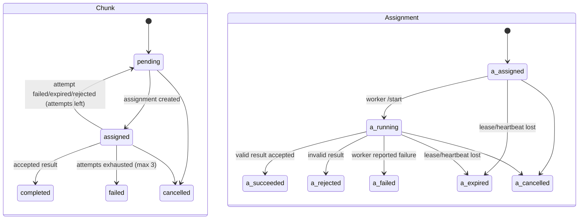

(`a_` prefixes only disambiguate the diagram; stored values are `assigned, running, succeeded, rejected, failed, expired, cancelled`.)

A **chunk** is a logical piece of work. An **assignment** is one attempt to execute a chunk on one device (it plays the role of "Execution"). Keeping them separate is what later allows *several* assignments of the same chunk (replication, audits) without changing the model.

### 10.3 Device

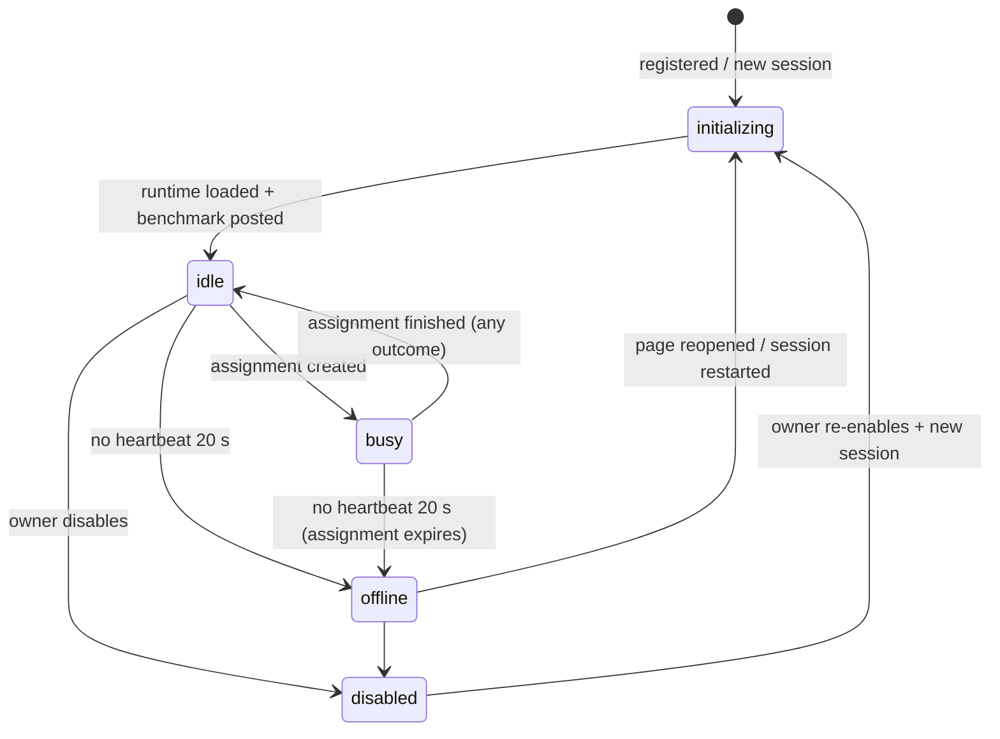

`online` is derived (`last_seen_at` within threshold) and also materialized by the reconciler as `offline`.

---

## 11. Failure handling (MVP level)

| Situation | Detection | Response |
|---|---|---|
| Device offline before task | stale heartbeat | Not eligible; task waits per `start_policy` |
| Device offline during chunk | no heartbeat 20 s (reconciler) | Assignment `expired`, device `offline`, chunk → `pending` with device in `excluded_device_ids`, reassigned |
| Chunk execution error | worker `POST …/fail` | Assignment `failed`; retry on a different device if possible |
| Timeout | `deadline_at = assigned_at + clamp(4 × estimated_seconds, 60 s, 600 s)` | Assignment `expired`; retry |
| Malformed / invalid output | structural validation fails | Assignment `rejected`, device `invalid_results += 1` (first Part 2 signal), retry elsewhere |
| Duplicate result (same assignment) | assignment already `succeeded` | `200` with no state change (idempotent) |
| Late result (expired/cancelled assignment) | assignment not `running` | `409`; stored as a `late_result` event with its payload digest (useful for Part 2), never merged |
| Retries exhausted | `attempt_count = 3` | Chunk `failed` → task `failed` with an explanation; no partial aggregation |
| User cancels | `POST /tasks/{id}/cancel` | Task `cancelled`, open assignments `cancelled`, next heartbeat returns `cancel` directive → worker terminates its Web Worker |
| No devices for too long | queued > `QUEUE_TIMEOUT` (10 min) | Task `failed` ("no eligible devices") |
| Task runs too long | running > `TASK_TIMEOUT` (15 min) | Task `failed` |
| Backend restart | — | All state in MongoDB; reconciler resumes: expires stale leases, re-runs stuck aggregation |
| Backend sleeping (free host) | first request is slow | Workers retry with backoff; dashboard shows "connecting"; demo runbook pre-warms |

All retry/timeout constants live in one config module.

---

## 12. Data model (MongoDB)

IDs are prefixed readable strings (`usr_`, `dev_`, `ds_`, `tsk_`, `chk_`, `asg_`, `pr_`, `art_`, `evt_`) stored in `_id`. All timestamps are server-side UTC.

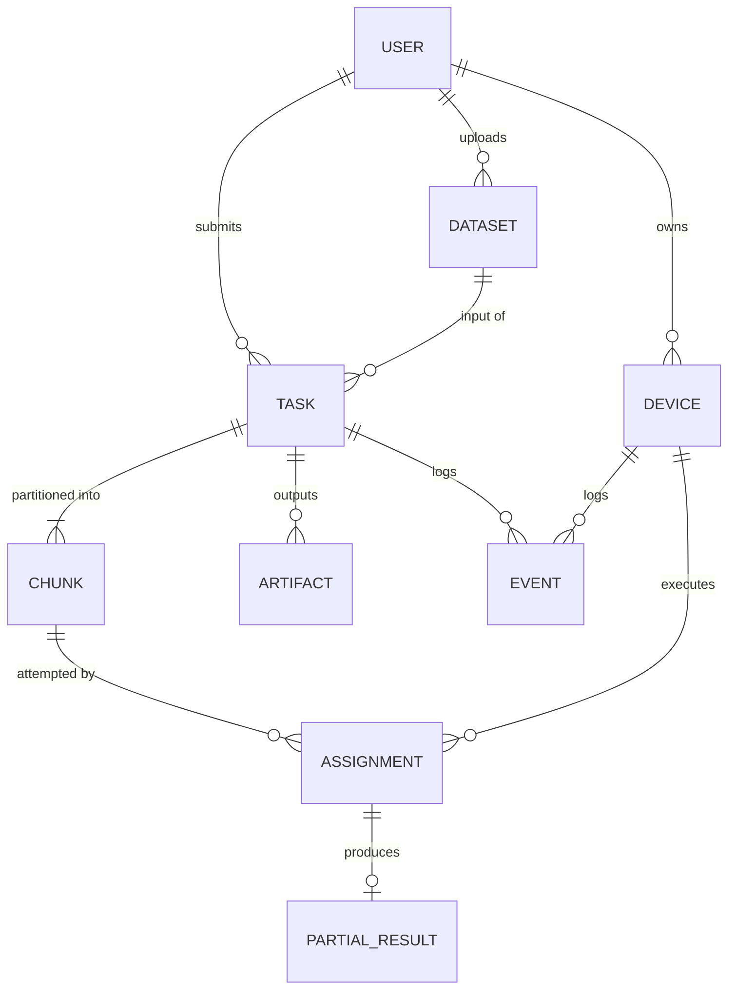

| Collection | Key fields | Notes |
|---|---|---|
| `users` | `email`, `password_hash`, `display_name`, `roles[]` (`user`, `contributor`, `admin`), `created_at` | One account can submit and contribute |
| `devices` | `owner_user_id`, `name`, `device_type`, `capabilities{…}` (§7.3, embedded = "DeviceCapability"), `runtime{kind, versions, bundle}`, `benchmark{score_cells_per_sec, bench_version, measured_at}`, `status`, `session_id`, `last_seen_at`, `current_assignment_id`, `token_hash`, `stats{succeeded, failed, expired, invalid_results, cells_processed}` | `stats` is the raw material for future trust |
| `datasets` | `owner_user_id`, `filename`, `size_bytes`, `sha256`, `raw_file_id` (GridFS), `profile{n_rows, columns[{name, dtype, missing, unique, min, max}]}` | "TaskInput" = dataset + task.prepared |
| `tasks` | `owner_user_id`, `name`, `task_type`, `kernel_version`, `dataset_id`, `params`, `execution{min_devices, max_devices, start_policy}`, `validation{…}`, `prepared{file_id, sha256, n_train, n_test, n_features, class_labels[], feature_names[]}`, `plan{created_at, shares[{device_id, rows, est_seconds}]}`, `status`, `status_history[]`, `result{artifact_ids[], metrics, reference_check}`, `error`, `verification_policy{mode: "none"}` | `verification_policy` exists from day one; Part 2 adds modes |
| `chunks` | `task_id`, `index`, `role` (`work`; future `challenge`), `row_start`, `row_end`, `n_rows`, `work_units`, `input_sha256`, `preferred_device_id`, `status`, `attempt_count`, `max_attempts`, `excluded_device_ids[]`, `accepted_assignment_id` | Row ranges must tile `[0, n_train)` |
| `assignments` | `task_id`, `chunk_id`, `device_id`, `attempt_no`, `purpose` (`primary`; future `replica`, `audit`), `status`, `assigned_at`, `started_at`, `finished_at`, `deadline_at`, `timings{download_ms, compute_ms, upload_ms, total_ms}`, `runtime_fingerprint`, `error{code, message}`, `partial_result_id` | = "Assignment + Execution" |
| `partial_results` | `assignment_id`, `chunk_id`, `task_id`, `device_id`, `kernel`, `kernel_version`, `payload`, `payload_sha256`, `structural{ok, errors[]}`, `acceptance` (`accepted_unverified`, `rejected_structural`; future `verified`, `disputed`, `rejected_verification`), `received_at` | Never deleted during a task — Part 2 needs them |
| `artifacts` | `task_id`, `kind`, `filename`, `file_id`, `size_bytes`, `sha256`, `created_at` | "FinalResult" = task.result + artifacts |
| `events` | `ts`, `type`, `task_id?`, `device_id?`, `chunk_id?`, `assignment_id?`, `data{}` | Append-only audit/timeline; feeds dashboards |

Indexes (minimum): `devices(status, last_seen_at)`, `chunks(task_id, status)`, `assignments(device_id, status)`, `assignments(chunk_id)`, `events(task_id, ts)`, `tasks(owner_user_id, created_at)`.

**Future Part 2 collections** (not created in the MVP; IDs/fields above already support them): `verification_records`, `challenges`, `trust_profiles`, `reputation_events`, `attack_events`, `reward_records`.

---

## 13. API surface (`/api/v1`)

Auth: users use `Authorization: Bearer <JWT>`; workers use `Authorization: Bearer <device_token>`. CORS allows the Vercel origin(s) and local dev origins.

| Method & path | Auth | Purpose |
|---|---|---|
| `GET /health` | none | Liveness + DB check (used to pre-warm) |
| `POST /auth/signup`, `POST /auth/login`, `GET /auth/me` | none / user | Accounts |
| `GET /task-types` | user | Catalog: task types, kernel versions, parameter JSON schemas |
| `POST /datasets` | user | Upload CSV (multipart) → profile |
| `GET /datasets/{id}` | owner | Dataset profile |
| `POST /tasks/validate` | user | Dry-run validation + plan preview against current devices |
| `POST /tasks` | user | Create task (validate + prepare) |
| `GET /tasks`, `GET /tasks/{id}` | owner | Task list / detail |
| `GET /tasks/{id}/status` | owner or demo-public flag | Compact live snapshot (task, chunks, assignments, devices) — cached ~1 s |
| `GET /tasks/{id}/events` | owner | Timeline |
| `POST /tasks/{id}/cancel` | owner | Cancel |
| `GET /tasks/{id}/artifacts`, `GET /artifacts/{id}/download` | owner | Results |
| `POST /devices` | user | Register a device → `device_id`, `device_token` |
| `GET /devices/mine`, `PATCH /devices/{id}` | owner | List, rename, disable/enable |
| `GET /network/summary` | user (or demo-public) | Online/idle/busy counts, device list (names, scores, states), active chunks |
| `GET /runtime/manifest` | device | Pyodide version, kernel bundle version + SHA-256, intervals |
| `GET /runtime/kernels/{version}` | device | Kernel bundle zip (`proofnet_kernels/core`) |
| `POST /worker/session` | device | Start session: capabilities, runtime, benchmark |
| `POST /worker/heartbeat` | device | Heartbeat + directives |
| `POST /worker/assignments/{id}/start` | device | assigned → running |
| `GET /worker/assignments/{id}/input` | device | Chunk input `.npz` |
| `POST /worker/assignments/{id}/result` | device | Submit partial result |
| `POST /worker/assignments/{id}/fail` | device | Report failure |
| `POST /admin/demo/reset` | admin | Clear demo tasks/datasets (keeps users/devices) |

Error format: `{ "error": { "code": "VALIDATION_FAILED", "message": "…", "details": [...] } }`.

---

## 14. Security boundary (honest statement)

**What the MVP protects:**

- **No user code executes anywhere.** Users choose from ProofNet-authored kernels. This is the primary RCE defence.
- **Contributor phones are sandboxed** by the browser + WebAssembly; the kernel bundle is integrity-checked by SHA-256.
- **No pickle across trust boundaries:** chunk inputs are `.npz` loaded with `allow_pickle=False`; worker results are JSON; uploaded CSVs are parsed by pandas with size/row limits; `.joblib` is only *produced* by the backend.
- **Authentication:** hashed passwords, JWT for users, random per-device tokens stored only as hashes, workers can only touch their own assignments.
- **Input limits:** upload size, row/feature caps, request body limits, simple per-token rate limiting.
- **Transport:** HTTPS in deployment (Vercel and the backend host both provide TLS).

**What the MVP does not protect (stated in the UI and report):**

- A contributor can return **well-formed but wrong** statistics. MVP results are `accepted_unverified`. Detecting this is Part 2.
- **Data confidentiality:** contributors receive raw rows of their partition. Do not upload sensitive data.
- Sybil devices, collusion, denial-of-service by many fake devices, and token theft from a contributor's own browser.
- It is a research prototype, not production-grade secure remote execution.

**Future path for custom code (not MVP):** team-reviewed, versioned kernel plugins first; later, possibly user-supplied *map* functions executed only inside the Pyodide sandbox on devices, while merge/finalize remain trusted backend code.

---

## 15. Observability for the demo

The `/network` and `/tasks/[id]` screens are designed for evaluators:

- Device cards: name, model, benchmark score, state (idle/busy/offline), current chunk, last heartbeat age.
- **Plan view**: rows per device and *why* (score share), predicted vs actual time.
- **Chunk table**: chunk → device → status → attempt → download/compute/upload ms.
- **Device lanes timeline**: horizontal bars per device showing when each chunk ran.
- Aggregation panel: merge done, metrics, **reference check result**, artifact downloads.
- Event feed: "Phone B finished chunk 1 in 180 ms", "Phone A went offline — chunk 0 reassigned to Laptop".
- Worker console on each phone shows its own log, so the audience can see the phone working.

No external monitoring stack. Backend logs to stdout (host log viewer) and to the `events` collection.

---

## 16. Deployment and local development

### 16.1 Deployed topology (all free tier)

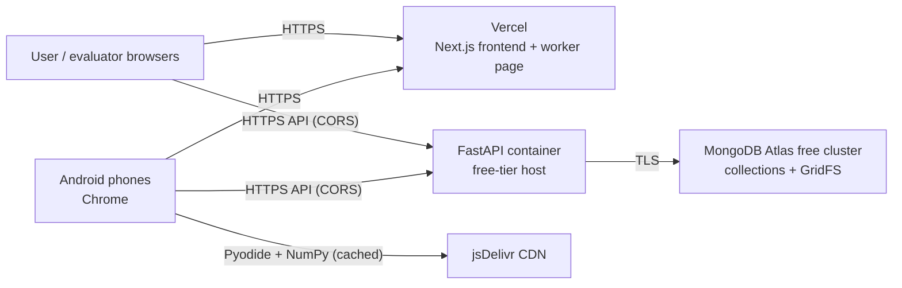

| Component | Host | Notes |
|---|---|---|
| Frontend | **Vercel** (Hobby/free) | `NEXT_PUBLIC_API_BASE_URL` points at the backend |
| Backend | **Any free container host that runs a long-lived `uvicorn` process with HTTPS.** **Chosen (P0, 2026-10-07): Render free web service.** Considered and rejected: Hugging Face Spaces (Docker Spaces now require a paid plan to create), Koyeb (no free plan listed). Terms re-checked in P0; re-check before deploying. | Must be a single instance. Must not depend on local disk. |
| Database + files | **MongoDB Atlas free cluster** | Allowlist the backend host egress (or `0.0.0.0/0` with strong credentials for the prototype) |
| Python runtime for phones | Pyodide from jsDelivr | Version pinned |

Free-tier realities to design around (verified for Render as of mid-2026; re-check before deploying):

- Render free web services spin down after 15 minutes without inbound traffic and take about a minute to wake; they have an ephemeral filesystem and very small CPU (0.1 CPU, 512 MB). Heartbeating workers keep the service awake during a demo; the runbook pre-warms it via `/health`.
- Atlas free cluster: 512 MB storage and limited operations per second → caching of status snapshots, modest polling intervals, reset script for old demo data.
- Because backend CPU may be tiny, keep backend computation light (merge + small reference check). If the reference check becomes slow on the chosen host, cap its dataset size.

The backend is **hosting-agnostic**: configuration entirely via environment variables (`MONGODB_URI`, `MONGODB_DB`, `JWT_SECRET`, `CORS_ORIGINS`, `MAX_UPLOAD_MB`, `PUBLIC_BASE_URL`). Container packaging files are created during implementation, not now.

### 16.2 Demo fallback: laptop backend + tunnel (still free)

If the cloud backend is slow or unavailable on demo day: run FastAPI on a team laptop (still using Atlas, or a local MongoDB), expose it with a free HTTPS tunnel (e.g. a Cloudflare quick tunnel), and point the frontend at it (a runtime "API URL" setting in the frontend, stored per browser, makes this a 30-second switch). Phones only need internet access. HTTPS is required because the Vercel page is HTTPS (mixed content) and Wake Lock needs a secure context.

### 16.3 Local development

| Process | Command (conceptual) | Port |
|---|---|---|
| MongoDB | local `mongod`, **or** a personal Atlas free database (`proofnet_dev`) | 27017 |
| Backend | `uvicorn proofnet_api.main:app --reload --host 0.0.0.0` | 8000 |
| Frontend | `next dev` | 3000 |
| Workers | `/contribute/run` in a desktop browser tab (several tabs = several devices), and/or `python -m cli_worker --count 3` | — |

Three processes plus the database — no Docker, queue or cache required. Testing a real phone against a laptop: use the tunnel from §16.2 (HTTPS), or accept that Wake Lock is unavailable over plain-HTTP LAN.

---

## 17. Part 2 insertion points

Part 1 is built so that Part 2 *adds* modules rather than rewriting the compute fabric.

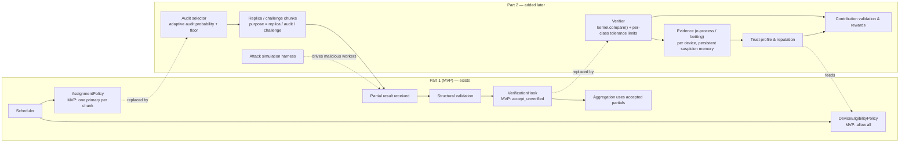

| Insertion point | MVP state | Part 2 use |
|---|---|---|
| `assignments.purpose` | always `primary` | `replica` (duplicate execution), `audit` |
| `chunks.role` | always `work` | `challenge` — hidden chunks with a known answer |
| `AssignmentPolicy` | one assignment per chunk | Choose which chunks/devices to audit with **adaptive audit probability** and a **minimum audit floor** (PWAV) |
| `partial_results.acceptance` + `VerificationHook` | `accepted_unverified` | `verified` / `disputed` / `rejected_verification`; aggregation can hold until verified |
| `kernel.compare(a, b)` | used for the reference check | Discrepancy statistic between replicas or vs backend recomputation |
| `runtime_fingerprint` per assignment | recorded | Defines the "class" for **per-class order-statistic tolerance limits** (e.g. kernel × version × runtime kind), calibrated from honest replica discrepancies |
| `devices.stats` + `events` | counters + log | Initial evidence; **e-process** state and **persistent suspicion memory** live in `trust_profiles` |
| `DeviceEligibilityPolicy` / scheduling weight | allow all / benchmark | Exclude or down-weight suspicious devices |
| Fault-injection flags in the CLI worker | for reliability tests | Grow into attack modes (random, scaled, lazy, partial drop, colluding) |
| `assignments.work_units` + accepted status | recorded | Reward = verified work units with trust adjustments |

Important property of the chosen workloads: the backend can **recompute any single chunk cheaply** from the stored prepared data, so audits can use backend recomputation as well as device replication. This lets Part 2 measure false-accusation behaviour with exact ground truth before relying on replicas.

---

## 18. Future scalability paths (not MVP)

- More kernels: distributed evaluation stage, partitioned exact kNN, dataset profiling, mini-batch k-means (approximate, flagged), ensemble/bagging (explicitly *not* equal to centralized training).
- Task graphs (train → evaluate → predict) built from the same chunk/assignment model.
- Dynamic scheduling: over-partitioning + work-stealing, benchmark updated from observed throughput.
- Native Android wrapper with a foreground service; GPU/desktop workers; WebGPU later.
- SSE/WebSocket for dashboard push.
- Multiple backend instances with a Mongo lease lock for the reconciler; hierarchical aggregation on devices (merge is already in `core/`).
- Stronger auth (device attestation), encrypted chunk transfer, privacy-preserving workloads.

---

## 19. Decision log

| ID | Decision | Alternatives rejected | Revisit when |
|---|---|---|---|
| D1 | Browser + Pyodide worker on Android | Termux, Chaquopy app, Kivy, `.exe` | Background execution becomes a requirement |
| D2 | HTTPS polling | WebSocket, push | Hundreds of devices or sub-second dispatch needed |
| D3 | Separate FastAPI service | FastAPI on Vercel serverless | — |
| D4 | MongoDB + GridFS only | Object storage, local disk | Files exceed free-tier capacity |
| D5 | Controlled catalog, no user code | Sandboxed user Python | Part 2 and security review complete |
| D6 | Sufficient-statistics kernels (GNB, Ridge) | Generic sklearn split-and-merge | Each new kernel must prove exact/flagged merge |
| D7 | Weighted proportional benchmark scheduler | Optimizers, ML-based schedulers | Measured imbalance hurts demos |
| D8 | Single instance + reconciler | Celery/Redis/queues | Multi-instance needed |
| D9 | JSON results, no pickle intake | Pickled partials | Never |
| D10 | OpenAPI-generated TS types | Hand-written types | — |
