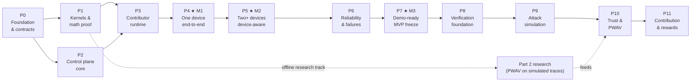

# ProofNet — Phase Plan

> Implementation roadmap derived from `ARCHITECTURE.md`. Terms (task, chunk, assignment, kernel, reconciler…) are defined there. `CLAUDE.md` holds the operating rules.
> Rule of the plan: **never start a phase until the previous phase's exit gate passes on real hardware where required.**

---

## 1. Roadmap at a glance

| Phase | Name | Category | Size | Testing level reached |
|---|---|---|---|---|
| P0 | Foundation & contracts | Must work now | S | — |
| P1 | Kernel library & correctness proof | Must work now | M | (math proven offline) |
| P2 | Control plane core | Must work now | L | Level 1 |
| P3 | Contributor runtime (Android browser worker) | Must work now | M | Level 2 |
| **P4** | **★ M1 — one device end-to-end** | **Must work now** | M | Levels 3–4 |
| **P5** | **★ M2 — multi-device, device-aware** | **Must work now** | M | Levels 5–6 |
| P6 | MVP reliability & failure handling | Must work now | M | Level 7 |
| **P7** | **★ M3 — demo hardening & MVP freeze** | **Must work now** | S–M | Level 8 |
| P8 | Verification foundation | Research / Part 2 | M | — |
| P9 | Attack simulation | Research / Part 2 | M | — |
| P10 | Trust, reputation & PWAV | Research / Part 2 | L | — |
| P11 | Contribution validation & rewards | Research / Part 2 | M | — |
| — | Scale-out enhancements (§13) | Future enhancement | — | — |

Sizes are relative effort (S < M < L) for a team of three, not calendar dates. Fix your own dates against your college calendar, with **M2 well before the first major review** and slack before M3.

### The three milestones

- **★ M1 (end of P4):** a user submits a `gaussian_nb_train` task → **one real Android phone** receives it → computes in Pyodide → result returns → backend produces `model.joblib` + `report.json` → user downloads it, and the reference check passes.
- **★ M2 (end of P5):** the same task is **split by measured capability across two real phones**, each computes a different chunk, the aggregator merges them, and the result equals centralized training. The dashboard makes this visible.
- **★ M3 (end of P7):** the deployed, free-tier system survives device loss mid-task, supports both MVP kernels, and the full live demo succeeds **five times in a row**.

---

## 2. Classification of work

| Must work now (P0–P7) | Future enhancement (after M3, optional) | Research / Part 2 (P8–P11) |
|---|---|---|
| Accounts, device registration, heartbeats | SSE/WebSocket dashboard push | Duplicate/replica execution |
| Browser Pyodide worker on Android, CLI worker | Native Android wrapper with foreground service | Hidden challenge chunks |
| `gaussian_nb_train`, `linear_ridge_train` | kNN, distributed evaluation, task graphs | Tolerance-aware verification |
| Validation, preparation, plan preview | Categorical encoding, more file formats | Malicious-node detection & attack simulation |
| Weighted proportional scheduler | Work-stealing / dynamic scheduling | Trust score, reputation history |
| Aggregation + reference check + artifacts | GPU / desktop workers | PWAV (tolerance limits, e-process, adaptive audits, floor, suspicion memory) |
| Leases, retries, cancel, invalid result handling | Multi-instance backend | Contribution validation, rewards, auditing |
| Free-tier deployment + LAN/tunnel fallback | Stronger auth / attestation | |

---

## 3. P0 — Foundation & contracts

**Objective.** Create a repository and set of conventions that every later phase builds on, and lock the decisions that are expensive to change.

**Dependencies.** None.

**Work.**
1. Monorepo exactly as in ARCHITECTURE §3.1 (empty packages with READMEs is fine); Python tooling (formatter, linter, type checker, pytest), TypeScript tooling (strict mode, ESLint), shared `.env.example`.
2. Create the MongoDB Atlas free cluster (one project); a `proofnet_dev` database per developer or a local `mongod`.
3. Choose the backend host: verify current free-tier terms for 2–3 candidates (Render free, Hugging Face Spaces, Koyeb); pick one primary; record it in `CLAUDE.md`. Confirm the Vercel project.
4. Pin versions: Python, Pyodide release, NumPy (as shipped in that Pyodide), scikit-learn, pandas, Next.js.
5. Write the **contract skeleton**: Pydantic models for the task manifest, heartbeat request/response, directive, assignment payload, partial result envelope, error format (ARCHITECTURE §8, §13). Set up OpenAPI → TypeScript type generation.
6. `datasets/` generator: deterministic synthetic classification (e.g. 100k × 16, 3 classes) and regression datasets under 25 MB; one small real public dataset per task type for credibility.
7. Agree branch/PR rules; Definition of Done (§12).

**Testing.** CI runs lint + type-check + an empty test suite for Python and TypeScript.

**Acceptance criteria.**
- Fresh clone → documented commands install everything on Windows/macOS/Linux laptops.
- Contract models compile and generate TS types.
- Backend host and versions recorded in `CLAUDE.md`.

**Deliverables.** Repo skeleton, CI, pinned versions, contract models, demo datasets.

**Risks.** Over-engineering the skeleton. *Mitigation:* nothing beyond the listed items.

**Gate to move on.** CI green; datasets generated; host chosen.

**Status: COMPLETE (2026-10-07).** Host = Render free; versions pinned in `CLAUDE.md` §12; contracts in `services/api/proofnet_api/contracts/` with `scripts/export_openapi.py` → `apps/web/lib/api/schema.d.ts`; datasets via `datasets/generate.py`; `.github/workflows/ci.yml` defined. Open items carried forward: Atlas cluster and Vercel project are created by the user (account actions) before P2 deploy; the first remote CI run happens when the repo is pushed.

---

## 4. P1 — Kernel library & correctness proof

**Objective.** Prove — before any networking exists — that distributed computation of the MVP kernels equals centralized computation, **in both CPython and Pyodide**.

**Dependencies.** P0. (Can run in parallel with P2.)

**Components.** `packages/kernels` (`core/` NumPy-only, `server/` sklearn).

**Work.**
1. `core/moments.py`: parallel mean/M2 merge, co-moment merge (ARCHITECTURE §4.2).
2. `core/gaussian_nb.py`: `map`, `merge`; `server/gaussian_nb.py`: `Params`, `validate`, `prepare`, `validate_partial`, `finalize`, `reference`, `compare`.
3. Same for `linear_ridge` (can follow GNB; must be done before P7).
4. `core/serialize.py`: canonical JSON, array encoding, SHA-256 digests; `core/bench.py` (`bench_v1`).
5. Kernel registry: `task_type@version → kernel`.
6. A lint check that `core/` imports only NumPy + stdlib.

**Testing.**
- **Equivalence tests:** for random datasets and random partitionings (1, 2, 3, 7 chunks, uneven sizes, chunks missing some classes), `finalize(merge(map(parts)))` equals `sklearn` centralized fit within the kernel tolerance; predictions on holdout identical.
- Edge cases: single-row chunk, constant feature, two classes, 50 classes, `alpha = 0` singular case.
- **Pyodide parity test:** run `core` map on the same chunk inside Pyodide under Node.js and in CPython; compare with `compare()`; record the observed discrepancy (first honest-discrepancy data for Part 2).
- Validation tests for every rule in ARCHITECTURE §5.1.

**Acceptance criteria.**
- All equivalence tests pass for GNB (Ridge before P7).
- Pyodide parity confirmed and discrepancy magnitudes logged.
- `model.joblib` built from merged stats loads in sklearn and predicts identically to centralized model.

**Deliverables.** `proofnet_kernels` package with tests; short `KERNELS.md` note per kernel (math, tolerance).

**Risks.** sklearn private-attribute changes across versions → pin sklearn, test attribute construction. Float drift across runtimes → tolerance per kernel.

**Gate.** GNB equivalence + Pyodide parity green.

**Status: COMPLETE (2026-10-07).** Both kernels (GNB and Ridge) implemented with equivalence/edge/validation tests (102 tests total pass), Pyodide parity measured (GNB 0.0, Ridge 7e-15), `model.joblib` round-trip verified, core-imports lint in tests, `KERNELS.md` written. Kernel params live in `proofnet_kernels.server.params` and are reused by the API manifest.

---

## 5. P2 — Control plane core

**Objective.** A running FastAPI backend with persistence, accounts, device registry, worker gateway (without dispatch), dataset upload/validation/preparation and task creation. **Testing Level 1.**

**Dependencies.** P0; P1 kernels for validation/preparation (can stub until P1 lands).

**Work.**
1. App skeleton: config, MongoDB connection (async), ID generation, error format, CORS, `/health`.
2. Auth: signup/login/me, JWT, password hashing, roles.
3. Devices: `POST /devices` (token issue + hash), `GET /devices/mine`, `PATCH`.
4. Worker gateway: `/runtime/manifest`, `/runtime/kernels/{version}` (zip of `core/` + SHA-256), `/worker/session`, `/worker/heartbeat` (returns empty directives for now).
5. Datasets: upload to GridFS, profiling, `GET /datasets/{id}`.
6. Tasks: `/task-types`, `/tasks/validate` (validation only; plan preview stub), `POST /tasks` (prepare → `.npz` in GridFS, status `queued`), list/detail.
7. Events collection + helper; reconciler loop skeleton (marks devices offline after 20 s).
8. Minimal frontend: login, signup, `/tasks/new` up to "Submit", `/tasks` list. Typed client.
9. **Deploy early:** backend to the chosen free host, frontend to Vercel, connected to Atlas. Catch CORS/HTTPS/cold-start problems now, not in P7.

**Testing.**
- API tests against a real MongoDB (local or Atlas test DB): auth, device registration, heartbeat updates `last_seen_at`, offline marking, upload limits, validation errors, preparation output digest.
- Manual: deployed frontend can sign up, upload, validate, create a task.

**Acceptance criteria (Level 1).**
- Backend runs locally and deployed; `/health` reports DB OK.
- A task can be created from the UI and its prepared `.npz` exists in GridFS with matching SHA-256.
- A device can be registered via API and goes `offline` 20 s after its last heartbeat.

**Deliverables.** Deployed backend + frontend skeleton; API docs at `/docs`.

**Risks.** Free host limits (cold start, CPU). *Mitigation:* measure now; keep compute light; record findings in `CLAUDE.md`.

**Gate.** Level 1 passes locally and deployed.

**Status: COMPLETE (2026-10-07).** 131 tests pass (API tests against real MongoDB); deployed to Render (backend), Vercel (frontend), Atlas; `/health` reports DB ok; signup → upload → validate → create task works on the live stack; prepared `.npz` is byte-reproducible with matching SHA-256; reconciler marks devices offline after 20 s. Measured Render cold start: 52.5 s (see `CLAUDE.md` section 12).

---

## 6. P3 — Contributor runtime

**Objective.** A real Android phone can register, load the Python runtime, benchmark itself and stay online. **Testing Level 2.**

**Dependencies.** P1 (kernel bundle, bench), P2 (device + worker endpoints).

**Work.**
1. `/contribute` (register this device, my devices) and `/contribute/run` (worker console).
2. `worker-runtime/compute.worker.ts`: load pinned Pyodide + NumPy, fetch/verify kernel bundle, run `bench_v1`, message protocol `{run, cancel}` (run unused until P4).
3. `controller.ts`: token storage, session start, heartbeat loop (2 s idle / 5 s busy), backoff on network errors, Screen Wake Lock, capability collection (ARCHITECTURE §7.3).
4. Worker console UI: loading progress, benchmark score, state, last heartbeat, log.
5. CLI worker: same session/heartbeat protocol in CPython (`--count N` simulated devices).
6. `/network` page: device cards with live state.

**Testing.**
- Real Android phone (at least two different models across the team) on Chrome: register, load, benchmark, appear `idle` on `/network`.
- Lock the screen / switch apps → device becomes `offline` within ~20 s; reopen → back to `idle` with the same `device_id`.
- CLI worker with `--count 3` shows three devices.
- Measure and record: first-load time on Wi-Fi and on mobile data, cached reload time, benchmark scores.

**Acceptance criteria (Level 2).**
- Two different physical Android phones register and show realistic, different benchmark scores.
- Device identity persists across page reloads.
- Offline/online transitions are correct and visible.

**Deliverables.** Working contributor experience on phones; measured runtime numbers in `CLAUDE.md`.

**Risks.** Pyodide load time on mobile; unsupported old phones; wake lock missing. *Mitigation:* preload on Wi-Fi, list minimum Chrome version, keep the screen on manually as backup.

**Gate.** Level 2 on two real phones.

**Status: COMPLETE (2026-10-07).** Level 2 passed on two physical Android phones (OPPO F31 Pro+ 5G: ~25.7–33.8 M cells/s, runtime load 11.4 s; vivo Y22: ~12.1–12.7 M cells/s, load 26.2 s; wake lock active on both). Backgrounded/locked phone → offline within ~20–25 s on `/network`; restarting the worker brings the same device back to idle. Also verified in headless Chromium (local and deployed) and with the CPython CLI worker (`--count 3`).

---

## 7. P4 — ★ M1: One device end-to-end

**This is the first genuinely successful ProofNet milestone. Nothing about multi-device work starts before it passes.**

**Objective.** User submits task → one registered device receives it → device computes → result returns → final output is generated correctly. **Testing Levels 3–4.**

**Dependencies.** P2, P3.

**Work.**
1. Planner in single-chunk mode: one eligible device → one chunk covering all training rows.
2. Assigner: create assignment with lease; heartbeat returns `run` directive.
3. Worker gateway: `/start`, `/input` (slice prepared `.npz`, stream, SHA-256), `/result`, `/fail`.
4. Worker: on `run` → start → download → verify → `map` in Web Worker → post result → idle.
5. Result intake pipeline (ARCHITECTURE §9.2) with `validate_partial` and the pass-through `VerificationHook`.
6. Aggregator: merge (trivial for one chunk), finalize, holdout metrics, reference check, artifacts to GridFS, task `completed`.
7. Task monitor `/tasks/[id]`: status timeline, the single chunk and its device, timings, metrics, reference check, downloads.

**Testing.**
- Level 3: with the CLI worker, an assignment is executed and its partial stored and accepted.
- Level 4: from the deployed UI, a real phone completes a `gaussian_nb_train` task; downloaded `model.joblib` loaded on a laptop predicts identically to a centralized sklearn model; reference check shows pass.
- Automated E2E test (backend + 1 CLI worker) in CI.

**Acceptance criteria (M1).**
- The full flow works on a real phone, three runs in a row, without manual DB edits.
- Report contains real timings, device identity and runtime fingerprint.
- No step is simulated; progress shown in the UI comes from actual state transitions.

**Deliverables.** M1 demo recording (keep it — it is also a fallback asset).

**Risks.** Large input download on mobile data. *Mitigation:* dataset sizing; show download time separately.

**Gate.** M1 acceptance passes.

**Status: COMPLETE — M1 passed (2026-10-07).** Single-chunk planner behind `ChunkPlanner`; `DeviceEligibilityPolicy` / `AssignmentPolicy` / `VerificationHook` interfaces; scheduler with conditional atomic transitions; `run` directive on heartbeat; `/start`, `/input`, `/result`, `/fail` with the ARCHITECTURE 9.2 intake pipeline (structural validation, payload digest, idempotent duplicates, 409 late results, rejected results counted); aggregator (coverage check, merge, finalize, holdout metrics, reference check, artifacts incl. report with timings/device/runtime); task monitor UI with queued-reason explanations; CLI and browser workers. Real phone (OPPO F31 Pro+ 5G, deployed Vercel+Render+Atlas): three consecutive runs (GNB, Ridge, GNB) all completed with the reference check PASSED; downloaded `model.joblib` predicts identically to a centralized sklearn fit (parameter difference 0.0). Bug found by the real-phone run and fixed: eligibility must be "battery ≥ 20% **or charging**" (workers now report charging).

---

## 8. P5 — ★ M2: Multi-device, device-aware execution

**Objective.** Split one task by measured capability across two (then more) real devices and merge correctly. **Testing Levels 5–6.**

**Dependencies.** P4.

**Work.**
1. Full planner (ARCHITECTURE §6.2): eligibility, weighted proportional rows, memory caps, deterministic ordering, `MIN_CHUNK_ROWS`.
2. `execution.min_devices / max_devices / start_policy`; tasks wait in `queued` until enough eligible devices.
3. Plan preview in `/tasks/validate` and the wizard (rows per device, predicted time).
4. Assigner with preferred device + fallback (`PREFERRED_WAIT`); one active assignment per device.
5. Aggregation over N partials, coverage check (row ranges tile `[0, N)`), fixed merge order.
6. Dashboard: plan vs actual, chunk table, device lanes timeline, event feed; `/network` shows which device holds which chunk.
7. Status snapshot caching (~1 s) to respect Atlas limits.

**Testing.**
- Unit: planner determinism (same inputs → same plan), proportionality, remainder distribution, memory split, offline/busy exclusion.
- Level 5: two real phones receive different chunks of one task (verify row ranges in the report).
- Level 6: merged model equals centralized fit (reference check) for 2, 3 and 4 devices (phones + CLI workers), with uneven benchmark scores.
- Stress: 8 CLI workers on one laptop, 10 consecutive tasks.

**Acceptance criteria (M2).**
- Phone A and Phone B each compute a different chunk; final result passes the reference check.
- The faster device receives proportionally more rows, and the plan explains why.
- Evaluators can see devices, chunks, timings and the final result on one screen.

**Deliverables.** M2 demo recording; planner documentation in code.

**Risks.** Scores fluctuate (thermal, battery saver). *Mitigation:* re-benchmark per session; show measured scores.

**Gate.** M2 acceptance on two real phones.

---

## 9. P6 — MVP reliability & failure handling

**Objective.** Make failures survivable and visible at MVP level. **Testing Level 7.**

**Dependencies.** P5.

**Work.**
1. Reconciler: lease/deadline expiry, offline → assignment `expired` → chunk `pending` with `excluded_device_ids`, max 3 attempts, queue and task timeouts, re-run stuck aggregation.
2. Cancel flow: task cancel → assignments cancelled → `cancel` directive → worker terminates Web Worker.
3. Invalid result → `rejected`, device `invalid_results` counter.
4. Idempotency: duplicate result `200` no-op; late result `409` + `late_result` event.
5. CLI worker **fault-injection flags**: `--fail-rate`, `--delay-ms`, `--die-after-start`, `--corrupt-result`, `--late-result`. (These become Part 2's attack harness.)
6. `linear_ridge_train` end-to-end (kernel from P1) — second workload proves the kernel abstraction.
7. Clear UI messages for each failure (“Phone A went offline — chunk 0 reassigned”).

**Testing (Level 7).** Scripted scenarios, each automated with CLI workers and repeated once manually with phones:

| Scenario | Expected |
|---|---|
| Worker dies mid-chunk | Chunk reassigned; task completes; reference check passes |
| Worker returns corrupt payload | Rejected; retried elsewhere; counter incremented |
| Worker always fails | Chunk fails after 3 attempts; task `failed` with reason |
| Late result after reassignment | 409; not merged; event logged |
| Duplicate result submission | No double counting |
| User cancels mid-run | All assignments cancelled; phones return to idle |
| Backend restart mid-task | Task still completes |
| No devices online | Task stays queued then fails at queue timeout |
| Phone screen locked mid-chunk | Device offline; chunk reassigned |

**Acceptance criteria.** All scenarios pass; Ridge task completes on two phones with reference check passing.

**Deliverables.** Scenario test suite; failure-handling notes in the report output.

**Risks.** Race conditions between reconciler and result intake. *Mitigation:* conditional updates on every transition; tests that submit results exactly at lease expiry.

**Gate.** Level 7 scenario suite green.

---

## 10. P7 — ★ M3: Demo hardening & MVP freeze

**Objective.** A repeatable live demo on free infrastructure. **Testing Level 8.**

**Dependencies.** P6.

**Work.**
1. Production deployment check: Vercel + backend host + Atlas, env vars, CORS, HTTPS, `/health` pre-warm.
2. **Fallback path** rehearsed: laptop backend + HTTPS tunnel + runtime API-URL switch in the frontend (ARCHITECTURE §16.2); recorded M2 video as last resort.
3. Demo dataset pack + `POST /admin/demo/reset`.
4. UI polish for projector: `/network` big-screen layout, readable fonts, clear states. No fake animations.
5. `DEMO_RUNBOOK.md`: phone prep (charged, Chrome updated, runtime preloaded on Wi-Fi, wake lock, battery saver off), own hotspot, order of actions, what to say, recovery steps.
6. Honest-limitations slide/section (security boundary, unverified results → Part 2).
7. Freeze: tag `mvp-1.0`; only bug fixes after this.

**Testing (Level 8).** Full demo script — register two phones, submit GNB, show split, merge, reference check, download; kill one phone during a second run; run Ridge — **five consecutive successful runs** on the deployed system, plus one run on the fallback path.

**Acceptance criteria (M3).**
- Five consecutive successful full demos.
- Fallback switch works in under 2 minutes.
- No paid service in use.

**Deliverables.** Tagged MVP, runbook, recordings, limitations statement.

**Risks.** Venue Wi-Fi, free-host outage. *Mitigation:* own hotspot; fallback path; recording.

**Gate to Part 2.** M3 passes. Part 2 integration work on the main branch starts only now.

---

## 11. Part 2 — Research phases (P8–P11)

Part 2 builds on the insertion points in ARCHITECTURE §17. **Research can start early offline** (after P1) using simulated workers and recorded partial results; **integration into the main system starts only after M3**. If one team of three owns Part 2, its early work is: PWAV simulation, honest-discrepancy calibration from P1/P4 data, and attack-model definitions.

### P8 — Verification foundation
- **Objective:** results can be checked, not just accepted.
- **Work:** `verification_records` collection; `AssignmentPolicy` that creates `replica` assignments for a configurable fraction of chunks; backend recomputation audits; hidden `challenge` chunks with known answers; `Verifier` using `kernel.compare()` with tolerance; `acceptance` states `verified / disputed / rejected_verification`; aggregation option "wait for verification".
- **Calibration:** collect honest replica discrepancies per class (kernel × version × runtime kind) → empirical distribution.
- **Acceptance:** honest runs produce zero false rejections across ≥ 200 audited chunks; injected corrupt results are rejected.

### P9 — Attack simulation
- **Objective:** reproducible malicious behaviour to evaluate defences.
- **Work:** extend CLI fault-injection into attack modes — random output, scaled statistics, lazy (compute on subset and extrapolate), label-flipping, intermittent cheating (cheat with probability q), colluding replicas returning identical wrong answers; `attack_events` ground-truth log; experiment runner producing detection metrics.
- **Acceptance:** each mode is detected (or its non-detection explained) with measured detection rate and latency.

### P10 — Trust, reputation & PWAV
- **Objective:** implement Evidence-Adaptive Auditing (PWAV) on top of P8/P9.
- **Work:** per-class order-statistic tolerance limits from calibration data; per-device betting/e-process evidence updated on each audit; adaptive audit probability with a minimum audit floor; persistent suspicion memory across sessions (`trust_profiles`, `reputation_events`); `DeviceEligibilityPolicy` and scheduling weights consume trust.
- **Acceptance:** measured lifetime false-accusation rate for honest nodes stays within the configured bound over long simulated runs; detection of attack modes from P9; audit cost decreases for consistently honest nodes.

### P11 — Contribution validation & rewards
- **Objective:** credit trustworthy work.
- **Work:** `reward_records`; reward = verified work units (cells) × trust adjustment; contributor dashboard of earned credits; audit trail. Non-monetary credits only — no tokens or blockchain.
- **Acceptance:** rewards reproducible from the event log; cheating devices earn nothing for rejected work.

---

## 12. Definition of Done (every phase)

- Code merged with tests; CI green.
- No simulated behaviour presented as real.
- Contracts updated (OpenAPI regenerated; TS types regenerated).
- `CLAUDE.md` updated if a decision, constraint or measured number changed; ARCHITECTURE/PHASE_PLAN updated if design changed — keep the three documents consistent.
- Phase acceptance criteria demonstrated (on real phones where the phase says so).

---

## 13. Future enhancements (after M3, not scheduled)

Distributed evaluation stage · partitioned exact kNN · task graphs · dataset profiling task · categorical encoding · SSE push for dashboards · native Android wrapper with foreground service · work-stealing scheduler · benchmark refresh from observed throughput · GPU/desktop workers · multi-instance backend with Mongo lease lock · hierarchical aggregation · stronger device authentication.

Each new kernel must document why its merge is exact (or explicitly label it approximate) and ship equivalence tests like P1.

---

## 14. Cross-phase risk register

| Risk | Impact | Mitigation | Owner phase |
|---|---|---|---|
| Android background throttling | Device drops mid-chunk | Wake lock, foreground + charging, offline → reassign | P3, P6 |
| Pyodide load time on mobile data | Slow start in demo | Preload on Wi-Fi; browser cache; own hotspot | P3, P7 |
| Free backend cold start / low CPU | Slow first request, slow reference check | Pre-warm, light backend work, size caps | P2, P7 |
| Free-tier terms change | Hosting breaks | Hosting-agnostic config; fallback path | P0, P7 |
| Atlas ops/storage limits | Throttled requests | Snapshot cache, intervals, demo reset | P5, P7 |
| Floating-point differences across runtimes | False mismatch | Per-kernel tolerance; parity tests | P1 |
| Race conditions in state transitions | Double merge / stuck tasks | Conditional atomic updates; reconciler idempotent | P4–P6 |
| Scope creep (Part 2 too early) | MVP never stable | Gates; Part 2 offline until M3 | all |
| Team integration friction | Contract drift | OpenAPI-generated types, contract-first P0 | P0 |
